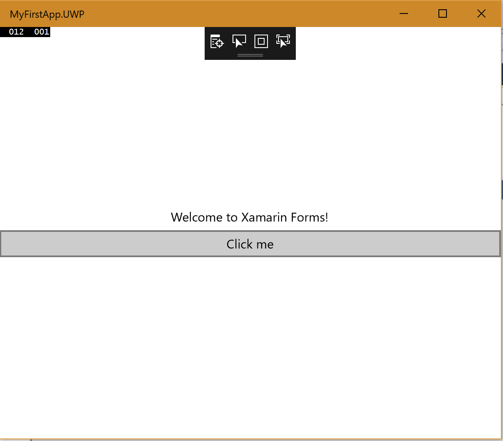
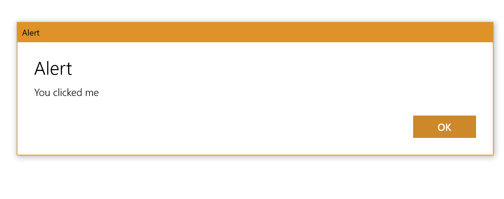
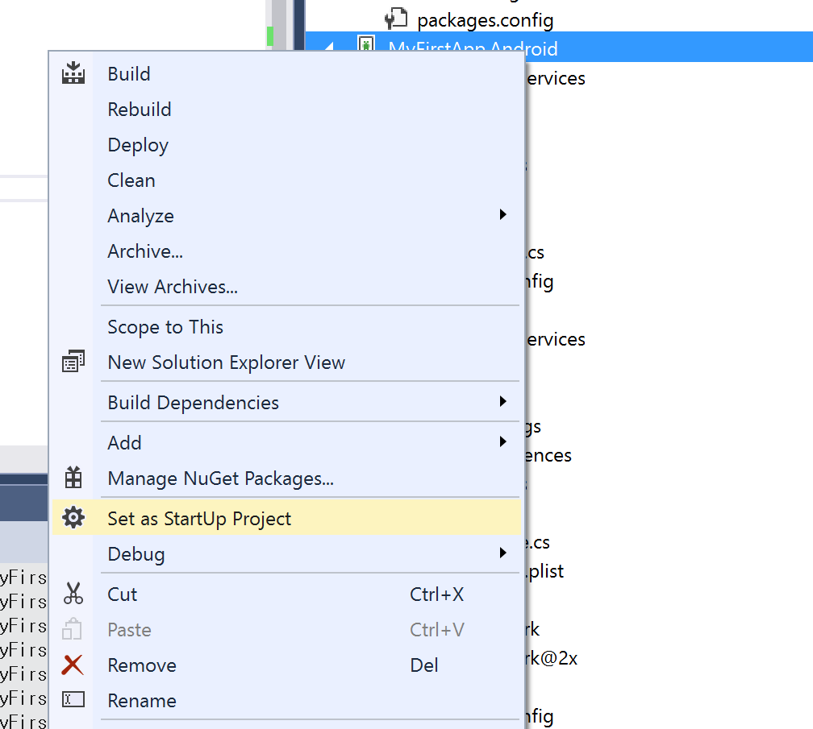
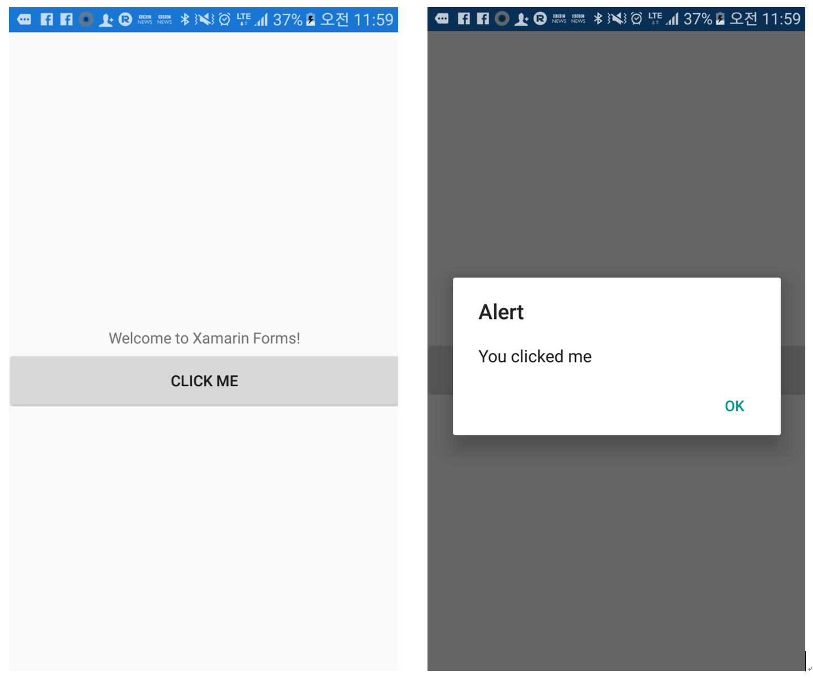

## 120 - Lab1 여러 플랫폼을 이용하여 프로젝트 실행해보기 
### 예상 소요시간
15분

### 목표
Xamarin.Forms 프로젝트의 구조를 이해하고, Alert 메세지를 보여주는 코드를 추가적으로 입력한 후에, 여러 프로젝트들로 실제 결과를 확인해 볼 것입니다. 

## 실습과정
### 프로젝트 열기
MyFirstApp 프로젝트를 여시고 실행하시기 바랍니다. 완성을 못하신 분들은 여기에서 다운로드 받으시기 바랍니다.

### 솔루션 구조 이해하기
1. 솔루션에 생성되는 여러가지 프로젝트들
* MyFirstApp - Xamarin.Forms 코드가 있는 PCL입니다. 대부분의 UI와 로직이 여기에 추가됩니다. 이 프로젝트는 운영체제나 개발 환경에 관계없이 항상 생성됩니다.
* MyFirstApp.iOS - iOS 애플리케이션을 생성 할 iOS 플랫폼 전용 프로젝트입니다. 
* MyFirstApp.Droid - Android에 배포 할 .apk를 생성하는 Android 관련 프로젝트입니다. 
* MyFirstApp.UWP - Windows 10 기기에서 동작하는 UWP 관련 프로젝트입니다.

2. 공유 코드 라이브러리(PCL)을 열어보시면 **App.xaml** 파일과 **MainPage.xaml** 파일이 있습니다. 클릭하여 확인해보세요.

3. 해당 플랫폼별 코드에는 공통점이 있습니다. 
* 최소한 2개의 플랫폼에 대한 어셈블리 참조를 가지고 있는데 **Xamarin.Forms.Core** 와 **Xamarin.Forms.Platform.XXX** 입니다. 
* 모든 프로젝트에는 초기화 코드가 있는데 Xamarin을 호출하는 코드인 **Forms.Init** 입니다. 이것은 모든 플랫폼 어셈블리에 정의 된 플랫폼 별 메소드입니다 (플랫폼마다 조금씩 다르게 구현 되더라도 항상 동일한 이름을 가집니다). 각각이 약간 다른 매개 변수를 취하는데  예를 들어 Xamarin.Forms가 리소스를 찾을 수 있도록 Android 패키지가 응용 프로그램 번들에 전달됩니다. 그런 다음 공유 코드에 정의 된 Application 파생 클래스의 새 인스턴스가 전달 된 LoadApplication이 호출됩니다. 

### Button 추가하기
1. Label을 아래의 코드와 같이 **StackLayout**으로 감싸시기 바랍니다. 
```
<StackLayout VerticalOptions="Center">
        <Label Text="Welcome to Xamarin Forms!" 
           VerticalOptions="Center" 
           HorizontalOptions="Center"/>        
</StackLayout>
```

2. **Label 코드** 아래 부분에 아래의 **Button 코드**를 추가하시기 바랍니다.
```
<Button Text="Click me" Clicked="ButtonClicked"/>
``` 

3. 완성된 코드는 다음과 같습니다.
```
<?xml version="1.0" encoding="utf-8" ?>
<ContentPage xmlns="http://xamarin.com/schemas/2014/forms"
             xmlns:x="http://schemas.microsoft.com/winfx/2009/xaml"
             xmlns:local="clr-namespace:MyFirstApp"
             x:Class="MyFirstApp.MainPage">
    <StackLayout VerticalOptions="Center">
        <Label Text="Welcome to Xamarin Forms!" 
           VerticalOptions="Center" 
           HorizontalOptions="Center"/>
        <Button Text="Click me" Clicked="ButtonClicked"/>
    </StackLayout>
</ContentPage>
```

4. 저장 후 실행하시면 Button이 생긴 것을 확인하실 수 있습니다. 하지만 지금은 클릭을 해도 아무런 이벤트가 발생하지 않네요! 



#### 버튼 클릭시 이벤트 추가하기 
1. **MainPage.xaml.cs** 파일 여시고 아래의 메소드를 **MainPage()** 메소드 아래에 추가하시기 바랍니다. 
```
private void ButtonClicked(object sender, EventArgs e)
        {
            this.DisplayAlert("Alert", "You clicked me", "OK");
        }
```

2. 완성된 **MainPage.xaml.cs** 코드는 아래와 같습니다. 
```
using System;
using Xamarin.Forms;

namespace MyFirstApp
{
    public partial class MainPage : ContentPage
    {
        public MainPage()
        {
            InitializeComponent();
        }

        private void ButtonClicked(object sender, EventArgs e)
        {
            this.DisplayAlert("Alert", "You clicked me", "OK");
        }
    }
}
```

3. 저장 후 실행하시면 아래의 그림처럼 Button이 동작하는 것을 확인하실 수 있습니다. 


4. 원하는 플랫폼을 시작 프로젝트로 설정하고 실행하세요. 저는 **MyFirstApp.Droid** 프로젝트를 **시작프로젝트로 설정**하고 안드로이드에서 애플리케이션을 실행시켜 보겠습니다. 


5. 실행된 모습입니다. UI는 약간 차이가 있지만, 기능은 동일하게 동작하는 것을 확인하실 수 있습니다. 
