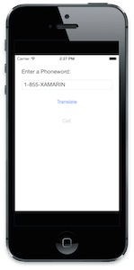
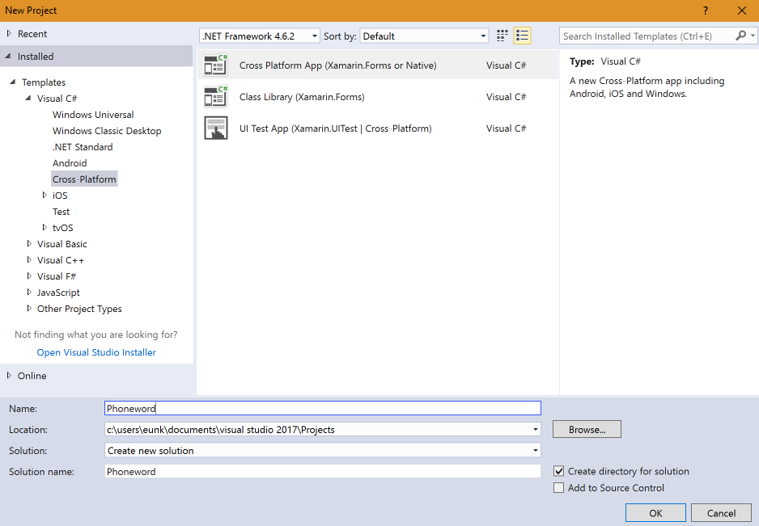
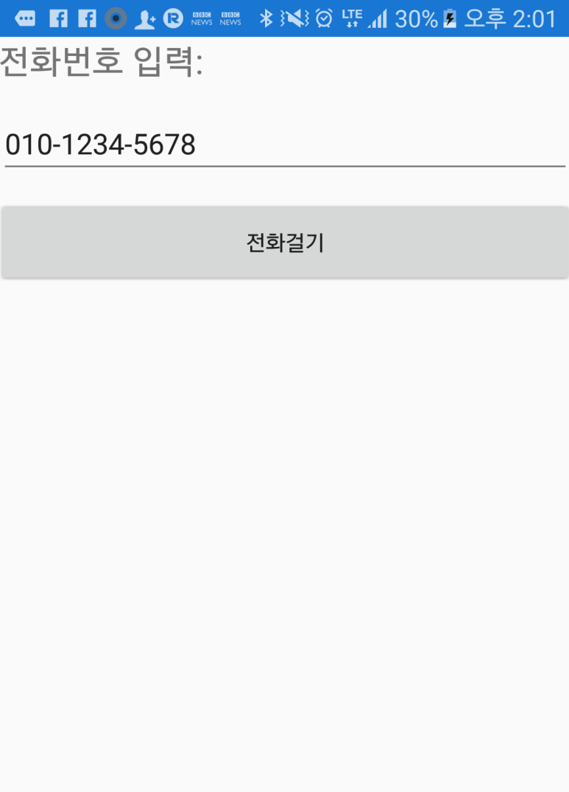

## 120 - Lab2 전화걸기 기능의 UI 만들기 
### 예상 소요시간
20분

### 목표
목표는 전화 번호를 입력받아서, 전화를 걸기위한 UI를 표시하는 프로그램을 만드는 것입니다. UI는 Label, Entry 및 두 개의 Button으로 구성됩니다.


## 실습과정
### 프로젝트 생성
1. **File > New > Project** 에서 새로운 프로젝트를 만드세요.
2. 프로젝트 템플릿에서 **Cross-Platform** 을 선택하신 후 **Cross Platform App(Xamarin.Forms or Native)**를 선택하신 다음 이름에 **Phoneword**를 입력하세요


3. **Blank App** 템플릿에, UI Technology는 **Xamarin.Forms**를 Code Sharing Strategy는 **Portable Class Libarary(PCL)**을 선택하시고 **OK** 버튼을 눌러서 프로젝트를 생성하시기 바랍니다. 


### UI 만들기
Label 컨트롤을 이용하여 **전화번호 입력:** Label을 만들고, 사용자 입력을 받는데 사용할 컨트롤인 **Entry**를 만들겠습니다. 마지막으로 전화걸기 기능을 위한 **Call** 버튼을 추가하겠습니다.  

1. **MainPage.xaml** 에서 "Welcome to Xamarin Forms!"를 출력하는 부분인 **Label** 부분을 전부 삭제 합니다. 

2. ContentPage 내부에 **StackLayout** 을 선언하고, Spacing 값은 15로 설정합니다. 입력해야할 코드는 아래와 같습니다.
```
<StackLayout Spacing="15">
        
</StackLayout>
```

3. **전화번호 입력:**을 안내하는 Label을 추가하겠습니다. **StackLayout** 내부에 아래의 코드를 추가하시기 바랍니다. 
```
<Label Text="전화번호 입력:" FontSize="Large"/>
```

4. 사용자 입력을 받기위해서 **Entry**라는 컨트롤을 사용해보겠습니다. 기본 값으로 "010-1234-5678"을 입력하겠습니다. **Label** 아래에 다음의 코드를 추가하시기 바랍니다.
```
<Entry Text="010-1234-5678" x:Name="phoneNumberText"/>
```

5. 마지막으로 전화걸기 버튼을 생성해 보겠습니다. 
```
<Button Text="전화걸기"/>
```

6. 완성된 코드는 다음과 같습니다. 
```
<?xml version="1.0" encoding="utf-8" ?>
<ContentPage xmlns="http://xamarin.com/schemas/2014/forms"
             xmlns:x="http://schemas.microsoft.com/winfx/2009/xaml"
             xmlns:local="clr-namespace:Phoneword"
             x:Class="Phoneword.MainPage">
    <StackLayout Spacing="15">
        <Label Text="전화번호 입력:" FontSize="Large"/>
        <Entry Text="010-1234-5678" x:Name="phoneNumberText"/>
        <Button Text="전화걸기"/>
    </StackLayout>
</ContentPage>
```

7. 저장 후 실행해보겠습니다. 버튼은 눌러지지만 아직 전화걸기 기능은 동작하지 않습니다! 



### Translate Button의 이벤트 구현하기
Translate 버튼을 눌렀을때 발생하는 이벤트를 구현하는 코드를 추가하겠습니다.

1. MainPage Class 내부에 변경된 전화번호를 담을 string 변수를 선언하세요
2. MainPage의 생성자에 translateButton이 눌렸을때 OnTranslate 이번테를 발생시키도록 이벤트 핸들러에 등록하세요.
3. OnTraslate 메소드에 버튼을 눌렀을때 숫자가 아닌 알파벳은 숫자로 변환해주는 메소드를 작성하세요.
완성된 코드는 아래와 같습니다. 

```
using System;
using System.Collections.Generic;
using System.Linq;
using System.Text;
using System.Threading.Tasks;
using Xamarin.Forms;

namespace Phoneword
{
    public partial class MainPage : ContentPage
    {
        Entry phoneNumberText;
        Button callButton;

        public MainPage()
        {
            
            this.Padding = new Thickness(20, 20, 20, 20);

            

            StackLayout panel = new StackLayout
            {
                Spacing = 15
            };

            panel.Children.Add(new Label
            {
                Text = "Enter a Phoneword:",
                FontSize = Device.GetNamedSize(NamedSize.Large, typeof(Label))
            });

            panel.Children.Add(phoneNumberText = new Entry
            {
                Text = "010-7797-0905",
            });
            

            panel.Children.Add(callButton = new Button
            {
                Text = "Call",
                IsEnabled = true,
            });

            this.Content = panel;

            callButton.Clicked += OnCall;
        }

        async void OnCall(object sender, System.EventArgs e)
        {
            if (await this.DisplayAlert(
                "Dial a Number",
                "Would you like to call " + phoneNumberText.Text + "?",
                "Yes",
                "No"))
            {

                var dialer = DependencyService.Get<IDialer>();
                if (dialer != null)
                {
                    await dialer.DialAsync(phoneNumberText.Text);
                }

            }

        }

        public interface IDialer
        {
            Task<bool> DialAsync(string number);
        }

        
    }
}
```
