## 311 - ListView를 이용하여 웹 서비스에서 받아온 Data 보여주기
### 예상 소요시간
30분

### 목표
List View를 이용하여 API에서 받아온 데이터를 매핑하는 방법을 보여줍니다.

## 실습과정
### 프로젝트 생성하기
RandomUser라는 이름의 프로젝트를 생성하고 실행하시기 바랍니다.
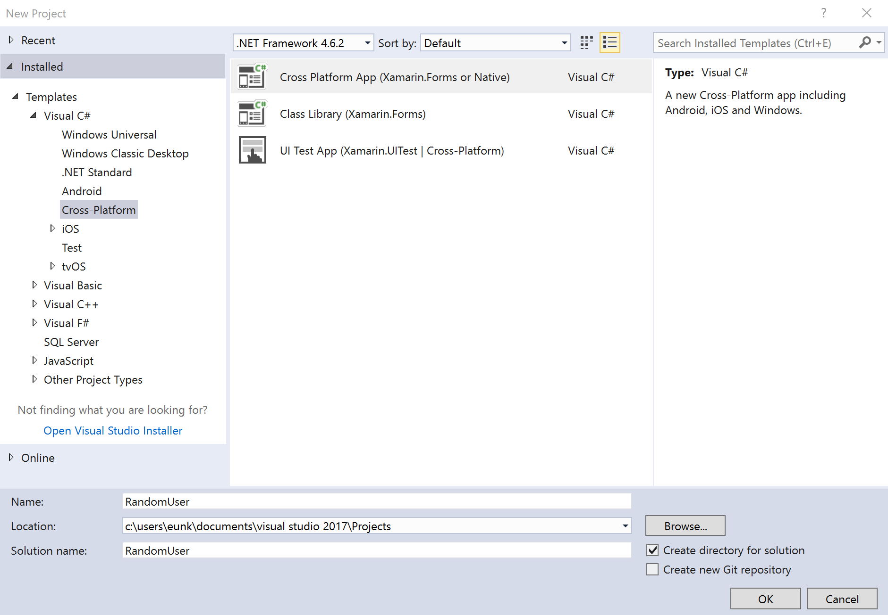

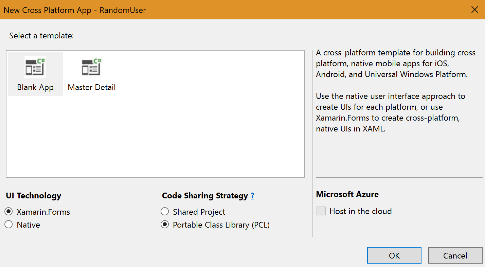

### 패키지 추가하기
Microsoft.Net.Http 패키지 추가하기

1. 솔루션인 **Solution 'RandomUser'**에서 마우스 오른쪽을 클릭하고 **Manage NuGet Packages for Solution**을 클릭합니다.
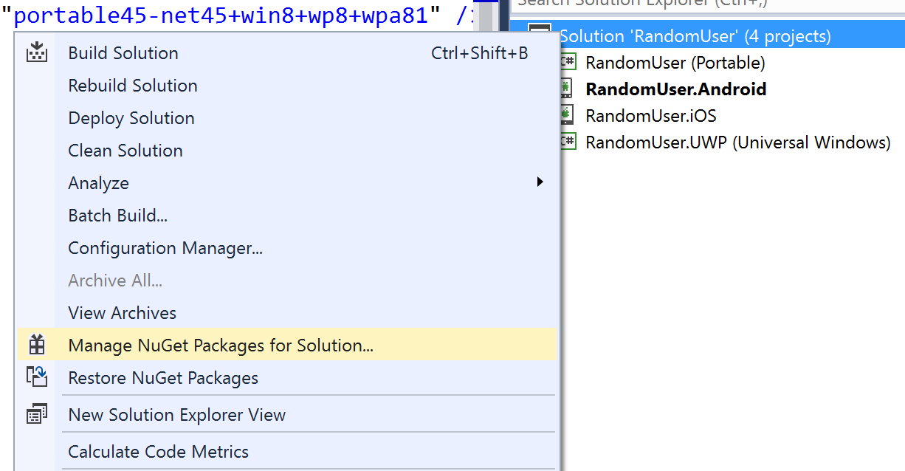

2. **Browse** 탭에서 검색창에 **microsoft.net.http**를 입력하고 가장 상단에 표시되는 아래의 스크린샷과 같은 패키지를 선택합니다.
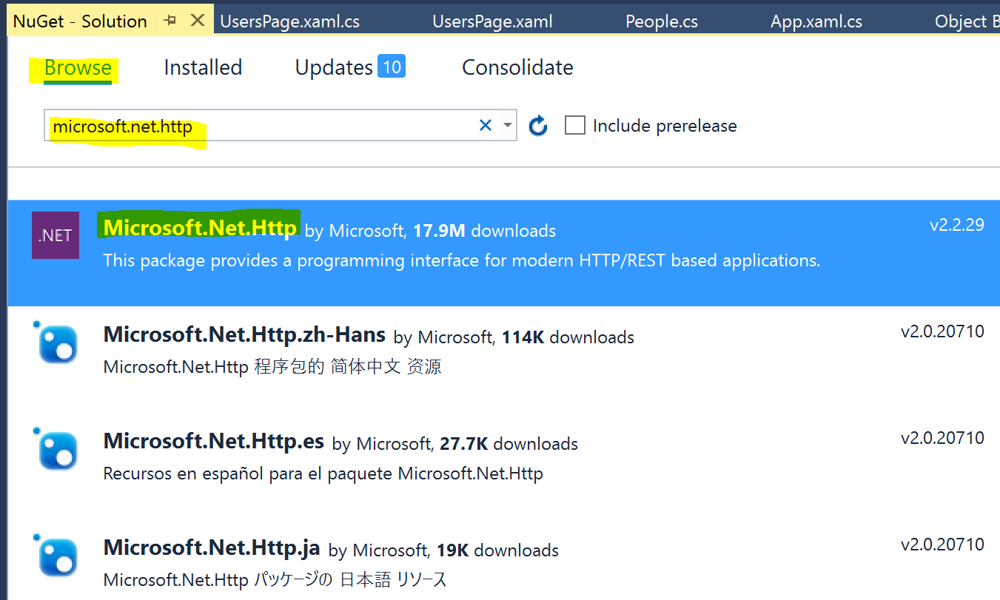

3. 우측의 화면에서 **RandomUser** 프로젝트 체크박스를 선택하고 **Install**버튼을 눌러 설치를 진행하시기 바랍니다.
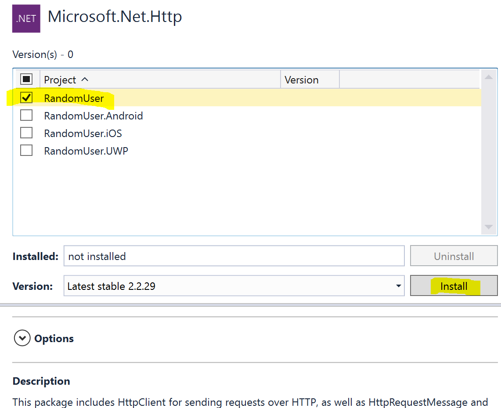

4. **OK**버튼을 눌러서 설치를 진행합니다.
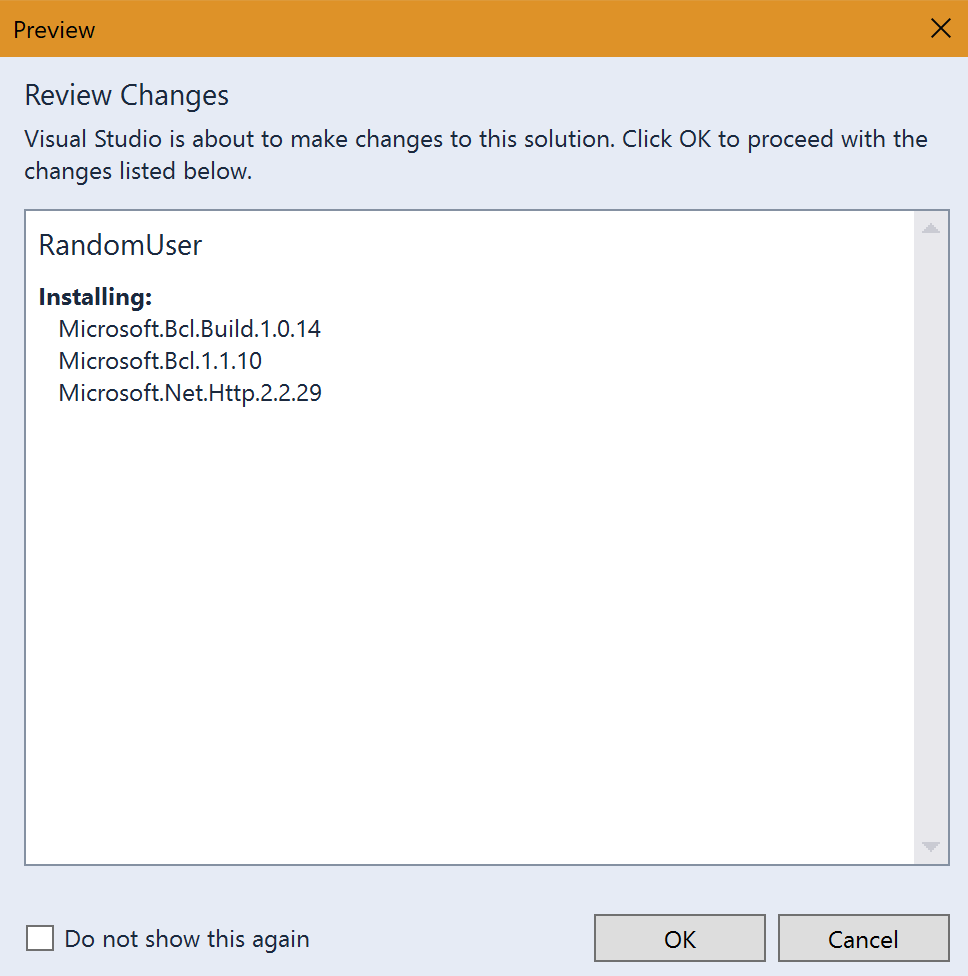

NewtonSoft.Json 패키지 추가하기

5. 다시 **Browse** 탭으로 이동해서 검색창에 **newtonsoft.json**를 입력하고 가장 상단에 표시되는 아래의 스크린샷과 같은 패키지를 선택합니다.
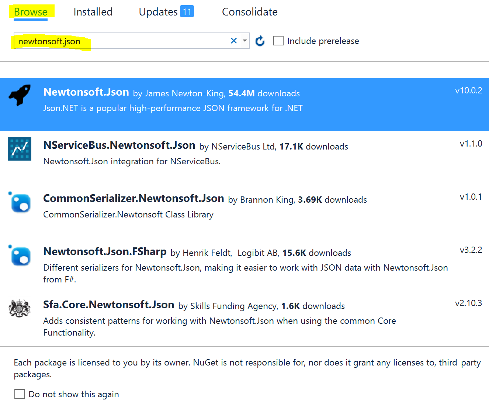

6. 우측의 화면에서 **RandomUser, RandomUser.Android, RandomUser.iOS, RandomUser.UWP** 프로젝트를 모두 선택하고 **Install**버튼을 눌러 설치를 진행하시기 바랍니다.
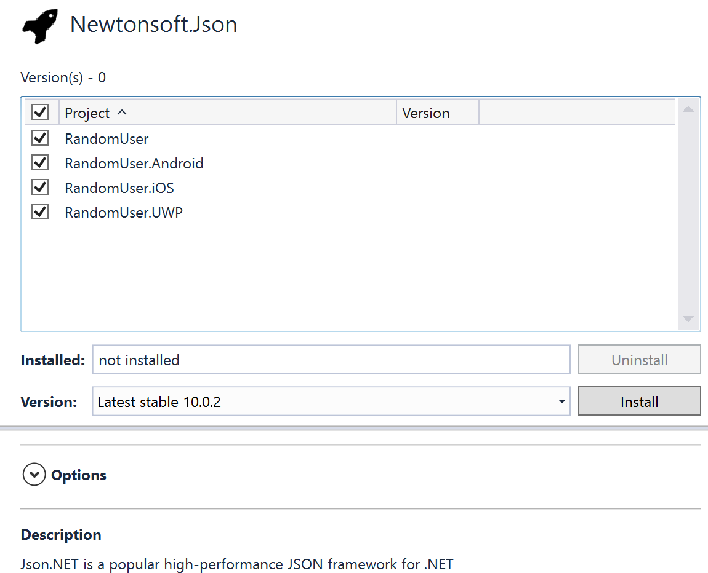

7. **OK**버튼을 눌러서 설치를 진행합니다.
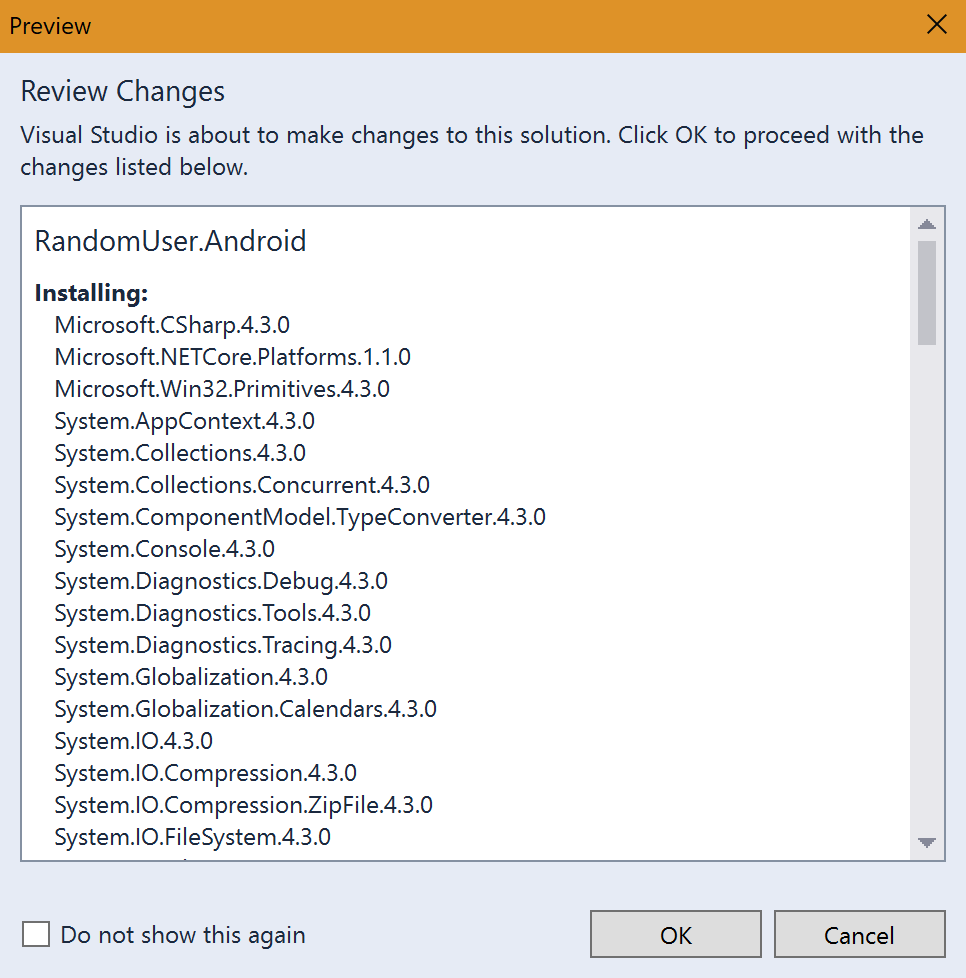

### Model 클래스 만들기 
데이터 모델이 되는 클래스를 만들어 보도록 하겠습니다. 

1. 공통 프로젝트인 **RandomUser(Portable)** 프로젝트에서 마우스 오른쪽을 클릭하고 **Add**버튼을 누른 후 **New Folder**를 선택합니다.
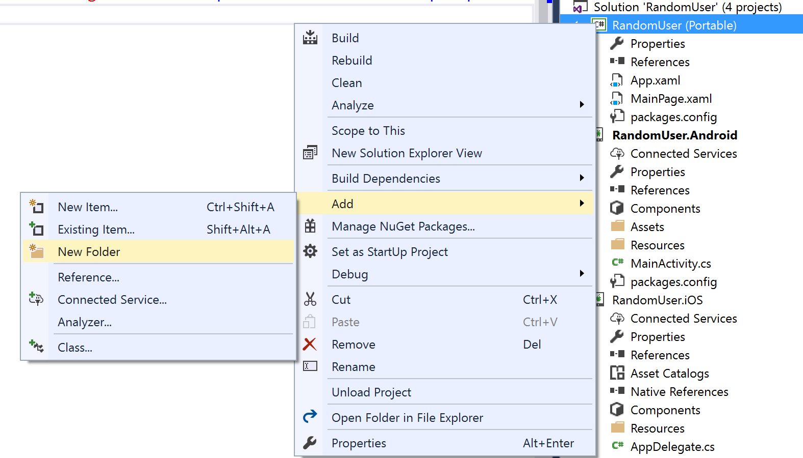

2. 이름에 **Models**를 입력합니다.
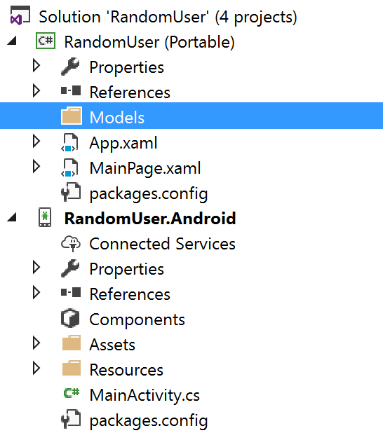

3. **Models**폴더에서 마우스 오른쪽을 클릭하고 **Add**버튼을 누른 후 **Class**를 선택합니다.
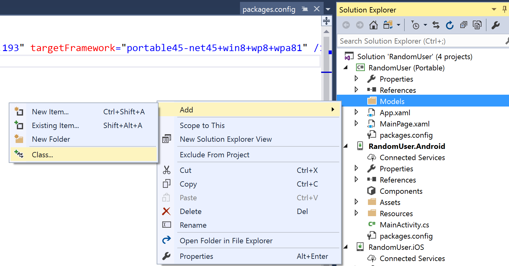

4. 클래스 이름에 **People.cs**를 입력한후 **Add**버튼을 눌러서 추가합니다.


5. People 클래스에서 namespace의 시작부분 부터 아래의 코드를 잘 복사하여 붙여넣으시기 바랍니다. 

```
namespace RandomUser
{
    public class Person
    {
        public string Name { get; private set; }

        public string ImageUrl { get; private set; }

        public string PhoneNumber { get; private set; }

        public Person(string name, string imageUrl, string phoneNumber)
        {
            Name = name;
            ImageUrl = imageUrl;
            PhoneNumber = phoneNumber;
        }
    }
}
```
위의 클래스는 ListView에서 데이터를 매핑할때 사용될 클래스로 이름, Image의 주소, 전화번호가 각각 string 타입으로 정의되어있습니다.  

### ListView 만들기 
받아온 데이터의 리스트를 보여줄 화면을 만들어 보도록 하겠습니다. 

1. 공통 프로젝트인 **RandomUser(Portable)** 프로젝트에서 마우스 오른쪽을 클릭하고 **Add**버튼을 누른 후 **New Item**을 선택하시기 바랍니다.


2. 좌측의 메뉴에서 **Visual C# -> Cross-Platform**을 선택하신 후, **Forms Black Content Page Xaml**을 선택하고, 이름에 **UsersPage.xaml**이라고 입력하신 후 **Add**버튼을 눌러서 추가하시기 바랍니다.
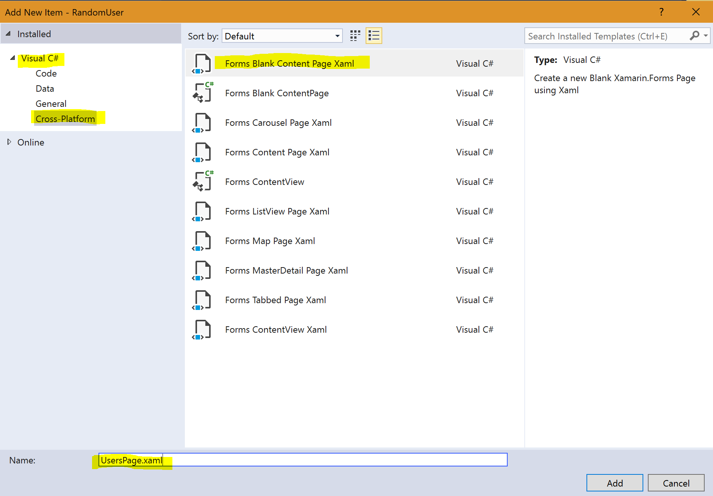

3. **UsersPage.xaml**페이지로 이동하신 후 ContentPage 내부에 아래의 코드를 추가하시기 바랍니다. 
```
<StackLayout>
    <ListView x:Name="listView">
        <ListView.ItemTemplate>
            <DataTemplate>
                <ImageCell Text="{Binding Name}" Detail="{Binding PhoneNumber}" ImageSource="{Binding ImageUrl}"/>
            </DataTemplate>
        </ListView.ItemTemplate>            
    </ListView>                                                                                             
</StackLayout>
```

### GetList 메소드 추가하기
다음의 메소드를 클래스 내부에 추가하시기 바랍니다.
```
async void GetUserInfo()
{
    //파싱할 데이터를 담을 변수들 
    var people = new List<Person>();
    string phoneNumber;
    string imageUrl;
    string name;
}
```

### 웹 서비스 요청 및 JSON 파싱하기 
랜덤으로 사용자 정보를 생성하여 제공해주는 [https://randomuser.me/](https://randomuser.me/) 웹 서비스를 이용하여 JSON 포멧의 데이터를 받아와서 ListView에 매핑하여 보여주겠습니다.

1. **string name;** 아래 부분에 다음의 코드를 입력하여 HttpClinet 객체를 만들고, response 변수에 요청 결과를 받아옵니다.
```
//JSON URL 요청 
string url = "https://randomuser.me/api/?page=3&results=10&seed=eunk";

//HttpClient 객체 생성
HttpClient client = new HttpClient();

//url로 요청 후 response에 결과값 담음
var response = await client.GetAsync(url);            
```

2. 다음의 네임스페이스를 클래스 가장 윗쪽 부분에 추가하여 붉은색으로 표기되는 에러메세지를 해결하실 수 있습니다.
```
using System.Net.Http;
``` 

3. 다음의 코드를 var response = await client.GetAsync(url); 아래 부분에 붙여넣으시기 바랍니다. JSON 포멧으로 작성된 response 결과를 파싱하여 원하는 값을 찾아내서 **List<Person>**에 추가하고, 그 결과를 ListView에서 선언해둔 변수인 **listView**를 이용하여 매핑하는 코드입니다.
```
//결과값이 성공적이면 
if (response.IsSuccessStatusCode)
{
    //결과 값을 String으로 변환한 후
    var content = await response.Content.ReadAsStringAsync();
    
    //NewtonSoft.Json 패키지를 이용하여 데이터 파싱 시작
    var data = JObject.Parse(content);                            

    for (int i = 0; i < 10; i++)
    {
        //JSON 데이터 중 phone, thumbnail, first 만 담아서 리스트에 추가 
        phoneNumber = (string)data["results"][i]["phone"];
        imageUrl = (string)data["results"][i]["picture"]["thumbnail"];
        name = (string)data["results"][i]["name"]["first"];
        people.Add(new Person(name, imageUrl, phoneNumber));
    }                

    //리스트뷰에 매핑 
    listView.ItemsSource = people;
}
```

4. 다음의 네임스페이스를 클래스 가장 윗쪽 부분에 추가하여 붉은색으로 표기되는 에러메세지를 해결하실 수 있습니다.
```
using Newtonsoft.Json.Linq;
```

5. 완성된 **UsersPage.xaml.cs** 코드는 다음과 같습니다. 
```
using Newtonsoft.Json.Linq;
using System.Collections.Generic;
using System.Net.Http;
using Xamarin.Forms;
using Xamarin.Forms.Xaml;

namespace RandomUser
{
    [XamlCompilation(XamlCompilationOptions.Compile)]
    public partial class UsersPage : ContentPage
    {
        public UsersPage()
        {
            InitializeComponent();

            //randomuser 페이지에서 JSON형식의 데이터를 받아와서, Listview에 매핑하는 메소드 
            GetUserInfo();
        }

        async void GetUserInfo()
        {
            //파싱할 데이터를 담을 변수들 
            var people = new List<Person>();
            string phoneNumber;
            string imageUrl;
            string name;

            //JSON URL 요청 
            string url = "https://randomuser.me/api/?page=3&results=10&seed=eunk";

            //HttpClient 객체 생성
            HttpClient client = new HttpClient();

            //url로 요청 후 response에 결과값 담음
            var response = await client.GetAsync(url);
            
            //결과값이 성공적이면 
            if (response.IsSuccessStatusCode)
            {
                //결과 값을 String으로 변환한 후
                var content = await response.Content.ReadAsStringAsync();
                
                //NewtonSoft.Json 패키지를 이용하여 데이터 파싱 시작
                var data = JObject.Parse(content);                            

                for (int i = 0; i < 10; i++)
                {
                    //JSON 데이터 중 phone, thumbnail, first 만 담아서 리스트에 추가 
                    phoneNumber = (string)data["results"][i]["phone"];
                    imageUrl = (string)data["results"][i]["picture"]["thumbnail"];
                    name = (string)data["results"][i]["name"]["first"];
                    people.Add(new Person(name, imageUrl, phoneNumber));
                }                

                //리스트뷰에 매핑 
                listView.ItemsSource = people;

            }
        }
    }
}
```

6. **UserPage()** 메소드의 **InitializeComponent();** 다음에 위에서 만든 메소드를 호출하는 코드를 추가하시기 바랍니다. 추가후 UsersPage() 메소드는 다움과 같습니다. 
```
public UsersPage()
{
    InitializeComponent();
    GetUserInfo();
}
```

7. **App.xaml.cs** 클래스로 이동하셔서 시작페이지를 **UsersPage()**로 변경해주시기 바랍니다. 변경후 **App()** 클래스는 다음과 같습니다.
```
public App()
{
    InitializeComponent();

    //MainPage = new RandomUser.MainPage();
    MainPage = new RandomUser.UsersPage();
}
```

8. 원하는 플랫폼별 프로젝트를 시작프로젝트로 설정하고 실행시켜서 결과를 확인해보시기 바랍니다. UWP에서 실행한 결과는 다음과 같습니다. 
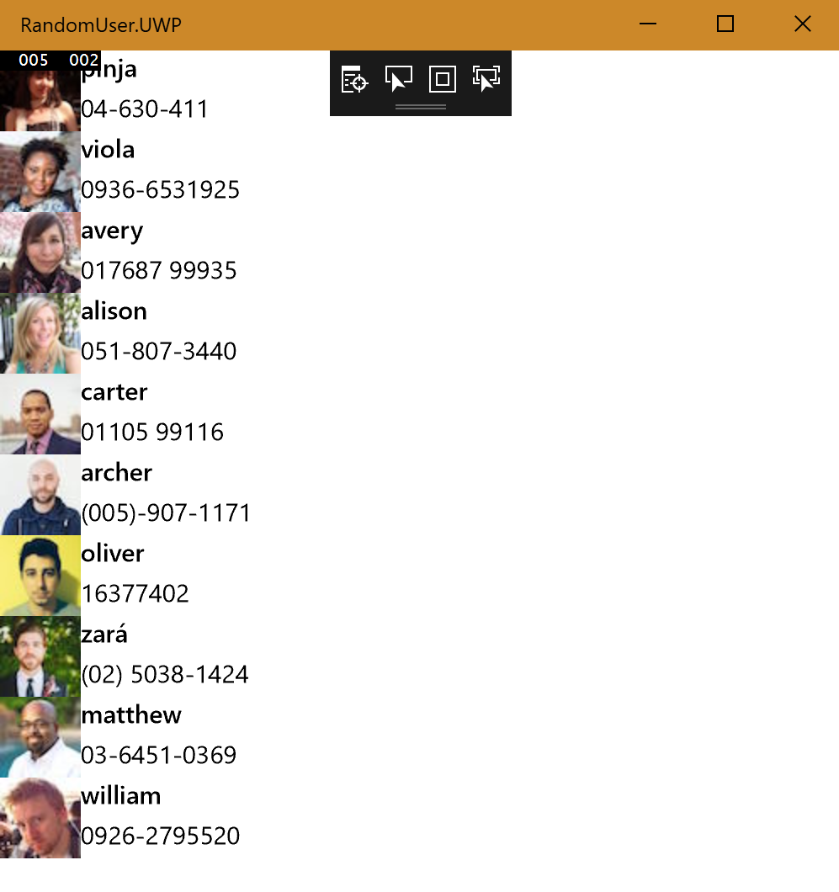

## 추가자료
