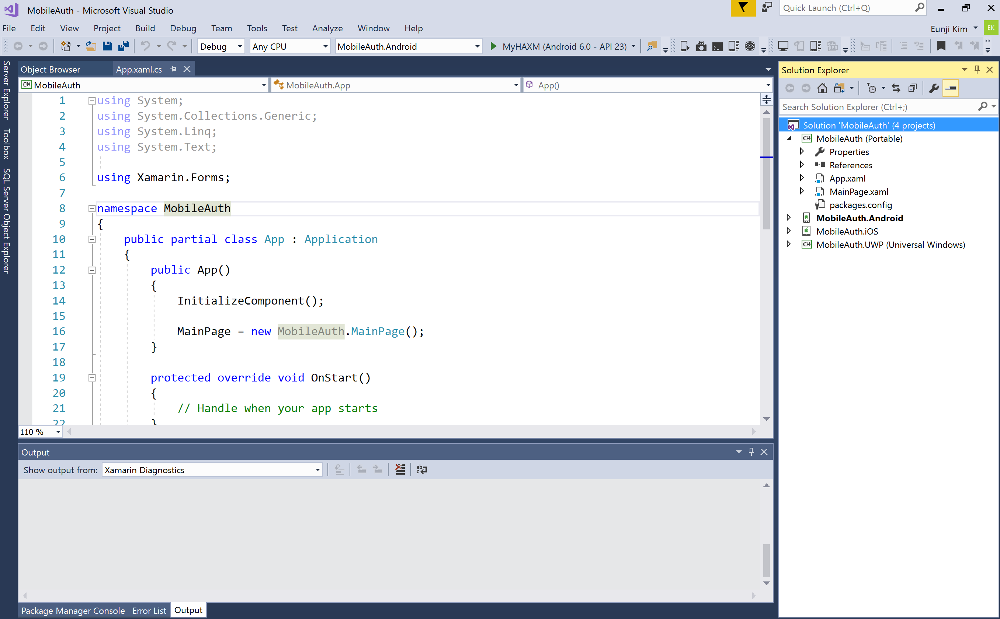
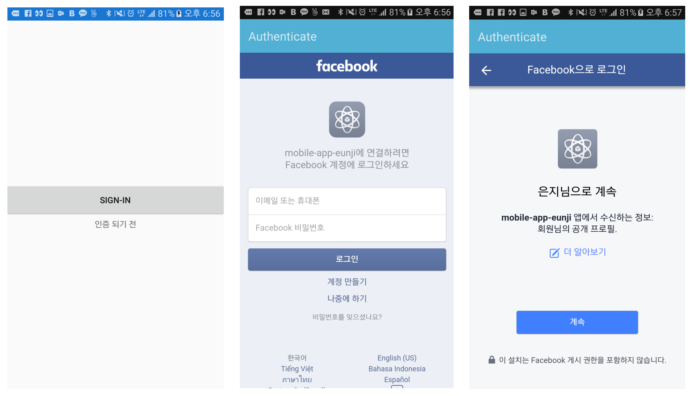
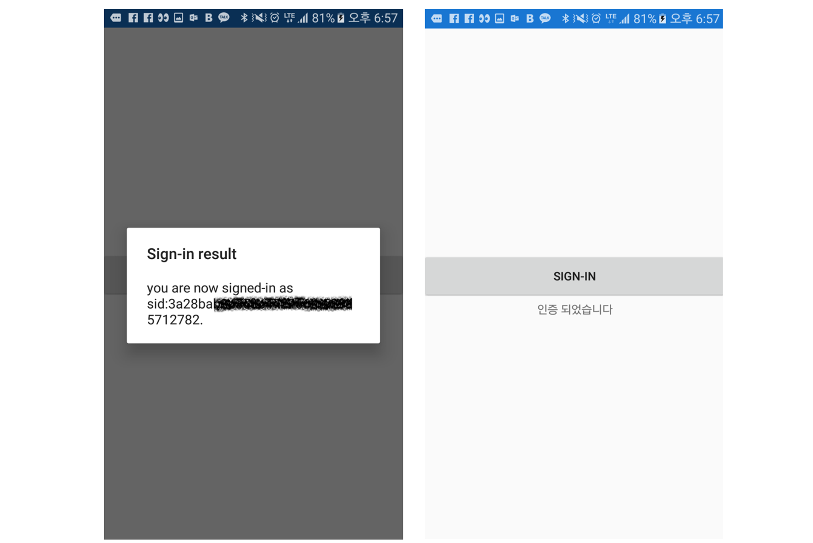
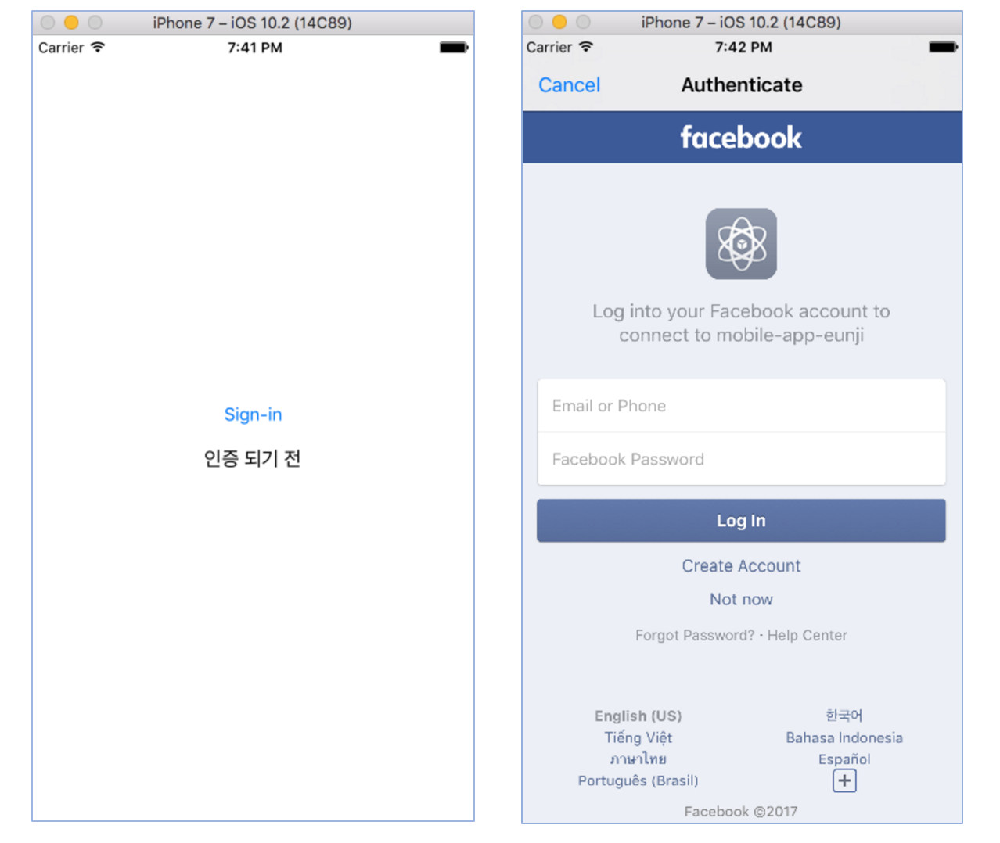
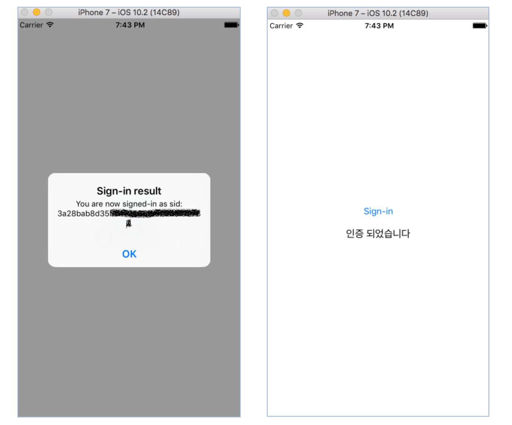
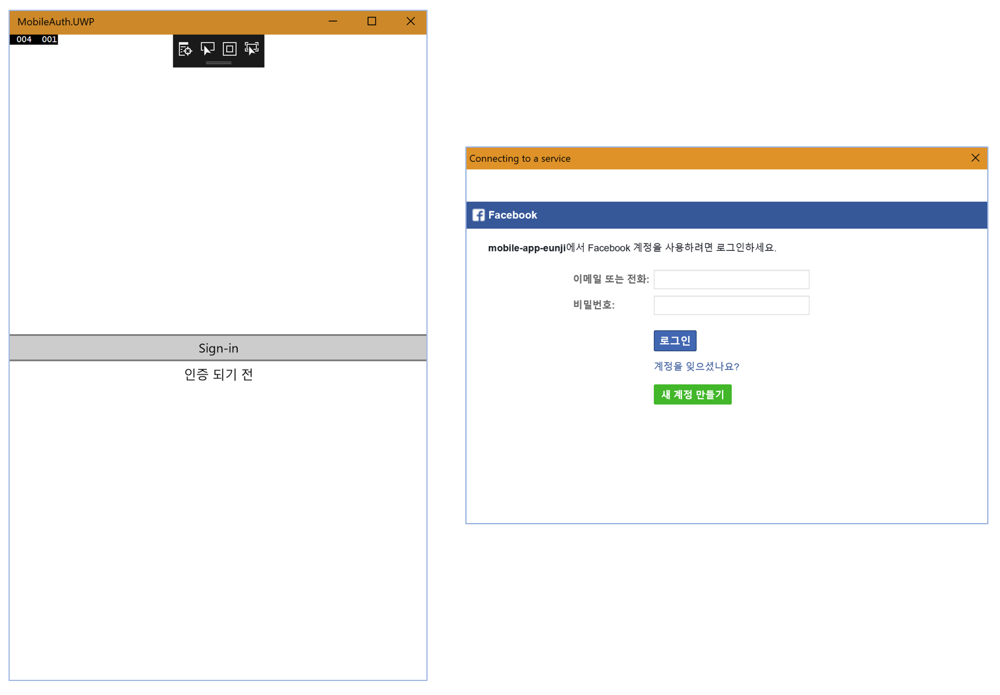
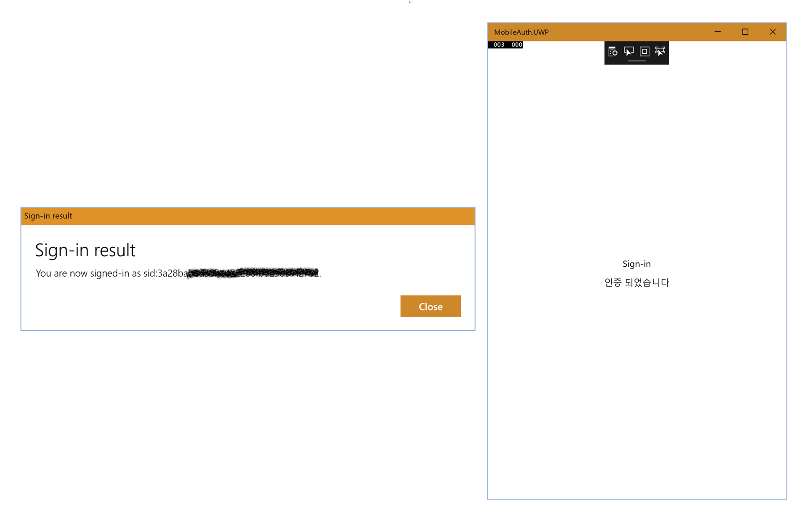

## AZR120 - Azure Mobile Backend 생성하기 

이번 튜토리얼에서는 마이크로소프트의 클라우드 서비스인 Azure의 Mobile App을 이용하여 여러분이 생성하신 애플리케이션에 Facebook 인증을 붙이는 예제를 함께 해볼 예정입니다. 
Azure Mobile App 이란, 모바일 개발시 꼭 필요로 하는 기능인 인증, 푸쉬알림, 오프라인 싱크 등등의 서비스를 쉽고 빠르게 만들수 있도록 도와주는 서비스입니다.
이번 실습에서 해볼 내용은 Azure Mobile App의 인증을 이용하여 Xamarin 애플리케이션에 Facebook 인증을 붙여 보도록 하겠습니다. 

* [Lab 1 - Azure Mobile App 생성하기](https://github.com/angie4u/xamarin-hol/blob/master/AZR120-Azure%20Mobile%20App/AZR120_Lab1.md) 
* [Lab 2 - Xamarin.Forms 프로젝트 생성 및 필요한 패키지 설치하기](https://github.com/angie4u/xamarin-hol/blob/master/AZR120-Azure%20Mobile%20App/AZR120_Lab2.md) 
* [Lab 3 - Facebook 개발자 페이지에서 내 앱 추가](https://github.com/angie4u/xamarin-hol/blob/master/AZR120-Azure%20Mobile%20App/AZR120_Lab3.md)
* [Lab 4 - Azure Mobile SDK에서 제공하는 메소드를 이용하여](https://github.com/angie4u/xamarin-hol/blob/master/AZR120-Azure%20Mobile%20App/AZR120_Lab4.md) 

### 예상 소요시간
30분

### 목표
Azure Mobile App의 Authenticate 서비스를 이용하여 페이스북 인증 구현하기 

## 실습과정
### Mobile App 인증기능 구현하기 - IAuthenticate 인터페이스 선언  

1. [Lab2](https://github.com/angie4u/xamarin-hol/blob/master/AZR120-Azure%20Mobile%20App/AZR120_Lab2.md) 에서 만들었던 **MobileAuth**프로젝트를 오픈하시기 바랍니다.



2. **App.xaml.cs** 파일을 오픈하시고 상단에 다음의 네임스페이스를 추가하시기 바랍니다. 

```
using System.Threading.Tasks;
```

3. App 클래스 정의 윗 부분에 IAuthenticate 인터페이스를 정의하기 위해 다음의 코드를 추가하시기 바랍니다.
```
public interface IAuthenticate
{
    Task<bool> Authenticate();
}
```

4. 인터페이스를 초기화하기 위해서 App 클래스 내부에 다음의 코드를 추가하시기 바랍니다.
```
public static IAuthenticate Authenticator { get; private set; }

public static void Init(IAuthenticate authenticator)
{
    Authenticator = authenticator;
}
```

5. 완성된 App.xaml.cs 파일은 다음과 같습니다.
```
using System;
using System.Collections.Generic;
using System.Linq;
using System.Text;
using System.Threading.Tasks;
using Xamarin.Forms;

namespace MobileAuth
{
    public partial class App : Application
    {
        public interface IAuthenticate
        {
            Task<bool> Authenticate();
        }

        public static IAuthenticate Authenticator { get; private set; }

        public static void Init(IAuthenticate authenticator)
        {
            Authenticator = authenticator;
        }

        public App()
        {
            InitializeComponent();

            MainPage = new MobileAuth.MainPage();
        }

        protected override void OnStart()
        {
            // Handle when your app starts
        }

        protected override void OnSleep()
        {
            // Handle when your app sleeps
        }

        protected override void OnResume()
        {
            // Handle when your app resumes
        }
    }
}
```

5. **MobileAuth(Portable)** 프로젝트에서 **MainPage.xaml** 파일을 열고, 기존에 생성되어있는 **Label을 주석처리** 합니다. 코드는 다음과 같습니다. 
```
<!--<Label Text="Welcome to Xamarin Forms!" 
           VerticalOptions="Center" 
           HorizontalOptions="Center" />-->
```

6. **ContentPage** 내부에 로그인 버튼 및 상태를 표기할 Label을 추가하시기 바랍니다. 코드는 다음과 같습니다.
```
<StackLayout VerticalOptions="Center">
    <Button x:Name="loginButton" Text="Sign-in" MinimumHeightRequest="30"
            Clicked="loginButton_Clicked"/>
    <Label x:Name="authLabel" Text="인증 되기 전" HorizontalTextAlignment="Center"/>
</StackLayout>
```

7. **MainPage.xaml.cs** 파일을 여시고, 클래스 내부에 인증 되었는지 여부를 확인하기 위한 bool 변수를 선언합니다. 
```
//인증 여부용 bool 변수
bool authenticated = false;
```

8. 클래스 내부에 로그인 버튼이 클릭되었을 때 인증을 처리할 메소드 및 OnAppearing 메소드를 추가하시기 바랍니다. 
```
async void loginButton_Clicked(object sender, EventArgs e)
{
    if (App.Authenticator != null)
        authenticated = await App.Authenticator.Authenticate();

    if(authenticated == true)
        authLabel.Text = "인증 되었습니다";
}


protected override void OnAppearing()
{
    base.OnAppearing();

    if(authenticated == true)
    {
        authLabel.Text = "인증 되었습니다";
        this.loginButton.IsVisible = false;
    }
}
```

9. 완성된 **MainPage.xaml.cs** 코드는 다음과 같습니다.
```
using System;
using Xamarin.Forms;

namespace MobileAuth
{
    public partial class MainPage : ContentPage
    {
        //인증 여부용 bool 변수
        bool authenticated = false;

        public MainPage()
        {
            InitializeComponent();
        }

        async void loginButton_Clicked(object sender, EventArgs e)
        {
            if (App.Authenticator != null)
                authenticated = await App.Authenticator.Authenticate();

            if (authenticated == true)
                authLabel.Text = "인증 되었습니다";
        }


        protected override void OnAppearing()
        {
            base.OnAppearing();

            if (authenticated == true)
            {
                authLabel.Text = "인증 되었습니다";
                this.loginButton.IsVisible = false;
            }
        }
    }
}
```

## Mobile App 인증기능 구현하기 - 플랫폼 별 프로젝트에서 인터페이스 구현 
### Android 

1. **MobileAuth.Android** 프로젝트에서 **MainActivity.cs** 클래스를 열고 상단에 다음의 using 구문을 추가합니다.
```
using Microsoft.WindowsAzure.MobileServices;
using System.Threading.Tasks;
using static MobileAuth.App;
``` 

2. IAuthenticate 인터페이스를 구현하도록 다음과 같이 MainActivity 클래스를 업데이트 합니다.
```
public class MainActivity : global::Xamarin.Forms.Platform.Android.FormsApplicationActivity, IAuthenticate
```

3. MainActivity 클래스 내부에 다음의 코드를 추가하여 IAthenticate 인터페이스의 Authenticate() 메소드 구현을 완료합니다.
```
private MobileServiceUser user;
MobileServiceClient client = new MobileServiceClient("여러분이 생성한 Mobile App 주소");

public async Task<bool> Authenticate()
{
    var success = false;
    var message = string.Empty;

    try
    {
        user = await client.LoginAsync(this, MobileServiceAuthenticationProvider.Facebook);
        if (user != null)
        {
            message = string.Format("you are now signed-in as {0}.",
                user.UserId);
            success = true;
        }
    }
    catch (Exception ex)
    {
        message = ex.Message;
    }

    // Display the success or failure message.
    AlertDialog.Builder builder = new AlertDialog.Builder(this);
    builder.SetMessage(message);
    builder.SetTitle("Sign-in result");
    builder.Create().Show();

    return success;
}
```

4. OnCreate() 메소드 내부의 LoadApplication(new App()) 윗 부분에 다음의 명령어를 추가합니다.
```
App.Init((IAuthenticate)this);
```

5. 완성된 **MainActivity.cs** 클래스는 다음과 같습니다.
```
using System;

using Android.App;
using Android.Content.PM;
using Android.Runtime;
using Android.Views;
using Android.Widget;
using Android.OS;

using Microsoft.WindowsAzure.MobileServices;
using System.Threading.Tasks;
using static MobileAuth.App;

namespace MobileAuth.Droid
{
    [Activity(Label = "MobileAuth", Icon = "@drawable/icon", Theme = "@style/MainTheme", MainLauncher = true, ConfigurationChanges = ConfigChanges.ScreenSize | ConfigChanges.Orientation)]
    public class MainActivity : global::Xamarin.Forms.Platform.Android.FormsAppCompatActivity, IAuthenticate
    {
        protected override void OnCreate(Bundle bundle)
        {
            TabLayoutResource = Resource.Layout.Tabbar;
            ToolbarResource = Resource.Layout.Toolbar;

            base.OnCreate(bundle);

            global::Xamarin.Forms.Forms.Init(this, bundle);
            LoadApplication(new App());
        }

        private MobileServiceUser user;
        MobileServiceClient client = new MobileServiceClient("여러분이 생성한 Mobile App 주소");

        public async Task<bool> Authenticate()
        {
            var success = false;
            var message = string.Empty;

            try
            {
                user = await client.LoginAsync(this, MobileServiceAuthenticationProvider.Facebook);
                if (user != null)
                {
                    message = string.Format("you are now signed-in as {0}.",
                        user.UserId);
                    success = true;
                }
            }
            catch (Exception ex)
            {
                message = ex.Message;
            }

            // Display the success or failure message.
            AlertDialog.Builder builder = new AlertDialog.Builder(this);
            builder.SetMessage(message);
            builder.SetTitle("Sign-in result");
            builder.Create().Show();

            return success;
        }
    }
}
``` 

6. 실행 결과는 다음과 같습니다.





### iOS
1. **MobileAuth.Android** 프로젝트에서 **AppDelegate.cs** 클래스를 열고 상단에 다음의 using 구문을 추가합니다.
```
using Microsoft.WindowsAzure.MobileServices;
using System.Threading.Tasks;
using static MobileAuth.App;
``` 

2. IAuthenticate 인터페이스를 구현하도록 다음과 같이 AppDelegate 클래스를 업데이트 합니다.
```
public partial class AppDelegate : global::Xamarin.Forms.Platform.iOS.FormsApplicationDelegate, IAuthenticate
```

3. AppDelegate 클래스 내부에 다음의 코드를 추가하여 IAthenticate 인터페이스의 Authenticate() 메소드 구현을 완료합니다.
```
private MobileServiceUser user;
MobileServiceClient client = new MobileServiceClient("여러분이 생성한 Mobile App 주소, http->https로 변경할 것");

public async Task<bool> Authenticate()
{
    var success = false;
    var message = string.Empty;
    try
    {
        // Sign in with Facebook login using a server-managed flow.
        if (user == null)
        {
            user = await client.LoginAsync(UIApplication.SharedApplication.KeyWindow.RootViewController,
                MobileServiceAuthenticationProvider.Facebook);
            if (user != null)
            {
                message = string.Format("You are now signed-in as {0}.", user.UserId);
                success = true;
            }
        }
    }
    catch (Exception ex)
    {
        message = ex.Message;
    }

    // Display the success or failure message.
    UIAlertView avAlert = new UIAlertView("Sign-in result", message, null, "OK", null);
    avAlert.Show();

    return success;
}
```

4. FinishedLaunching() 메소드 내부의 LoadApplication(new App()) 윗 부분에 다음의 명령어를 추가합니다.
```
App.Init(this);
```

5. 완성된 **AppDelegate.cs** 클래스는 다음과 같습니다.
```
using System;
using System.Collections.Generic;
using System.Linq;

using Foundation;
using UIKit;

using Microsoft.WindowsAzure.MobileServices;
using System.Threading.Tasks;
using static MobileAuth.App;

namespace MobileAuth.iOS
{
    // The UIApplicationDelegate for the application. This class is responsible for launching the 
    // User Interface of the application, as well as listening (and optionally responding) to 
    // application events from iOS.
    [Register("AppDelegate")]
    public partial class AppDelegate : global::Xamarin.Forms.Platform.iOS.FormsApplicationDelegate, IAuthenticate
    {
        private MobileServiceUser user;
        MobileServiceClient client = new MobileServiceClient("여러분이 생성한 Mobile App 주소, http->https로 변경할 것");

        public async Task<bool> Authenticate()
        {
            var success = false;
            var message = string.Empty;
            try
            {
                // Sign in with Facebook login using a server-managed flow.
                if (user == null)
                {
                    user = await client.LoginAsync(UIApplication.SharedApplication.KeyWindow.RootViewController,
                        MobileServiceAuthenticationProvider.Facebook);
                    if (user != null)
                    {
                        message = string.Format("You are now signed-in as {0}.", user.UserId);
                        success = true;
                    }
                }
            }
            catch (Exception ex)
            {
                message = ex.Message;
            }

            // Display the success or failure message.
            UIAlertView avAlert = new UIAlertView("Sign-in result", message, null, "OK", null);
            avAlert.Show();

            return success;
        }

        //
        // This method is invoked when the application has loaded and is ready to run. In this 
        // method you should instantiate the window, load the UI into it and then make the window
        // visible.
        //
        // You have 17 seconds to return from this method, or iOS will terminate your application.
        //
        public override bool FinishedLaunching(UIApplication app, NSDictionary options)
        {
            global::Xamarin.Forms.Forms.Init();

            App.Init(this);
            LoadApplication(new App());

            return base.FinishedLaunching(app, options);
        }
    }
}
```

6. 실행 결과는 다음과 같습니다.





### UWP (= Windows 10)

1. **MobileAuth.UWP** 프로젝트에서 **MainPage.xaml.cs** 클래스를 열고 상단에 다음의 using 구문을 추가합니다.
```
using Microsoft.WindowsAzure.MobileServices;
using System.Threading.Tasks;
using Windows.UI.Popups;
using static MobileAuth.App;
``` 

2. IAuthenticate 인터페이스를 구현하도록 다음과 같이 MainPage 클래스를 업데이트 합니다.
```
public sealed partial class MainPage : IAuthenticate
```

3. MainPage 클래스 내부에 다음의 코드를 추가하여 IAthenticate 인터페이스의 Authenticate() 메소드 구현을 완료합니다.
```
// Define a authenticated user.
private MobileServiceUser user;
MobileServiceClient client = new MobileServiceClient("여러분이 생성한 Mobile App 주소, http->https로 변경할 것");

public async Task<bool> Authenticate()
{
    string message = string.Empty;
    var success = false;

    try
    {
        // Sign in with Facebook login using a server-managed flow.
        if (user == null)
        {
            user = await client.LoginAsync(MobileServiceAuthenticationProvider.Facebook);
            if (user != null)
            {
                success = true;
                message = string.Format("You are now signed-in as {0}.", user.UserId);
            }
        }

    }
    catch (Exception ex)
    {
        message = string.Format("Authentication Failed: {0}", ex.Message);
    }

    // Display the success or failure message.
    await new MessageDialog(message, "Sign-in result").ShowAsync();

    return success;
}
```

4. MainPage() 메소드 내부의 LoadApplication() 윗 부분에 다음의 명령어를 추가합니다.
```
MobileAuth.App.Init(this);
```

5. 완성된 **MainPage.xaml.cs** 클래스는 다음과 같습니다.
```
using System;
using System.Collections.Generic;
using System.IO;
using System.Linq;
using System.Runtime.InteropServices.WindowsRuntime;
using Windows.Foundation;
using Windows.Foundation.Collections;
using Windows.UI.Xaml;
using Windows.UI.Xaml.Controls;
using Windows.UI.Xaml.Controls.Primitives;
using Windows.UI.Xaml.Data;
using Windows.UI.Xaml.Input;
using Windows.UI.Xaml.Media;
using Windows.UI.Xaml.Navigation;

using Microsoft.WindowsAzure.MobileServices;
using System.Threading.Tasks;
using Windows.UI.Popups;
using static MobileAuth.App;

namespace MobileAuth.UWP
{
    public sealed partial class MainPage : IAuthenticate
    {
        // Define a authenticated user.
        private MobileServiceUser user;
        MobileServiceClient client = new MobileServiceClient("여러분이 생성한 Mobile App 주소, http->https로 변경할 것");

        public async Task<bool> Authenticate()
        {
            string message = string.Empty;
            var success = false;

            try
            {
                // Sign in with Facebook login using a server-managed flow.
                if (user == null)
                {
                    user = await client.LoginAsync(MobileServiceAuthenticationProvider.Facebook);
                    if (user != null)
                    {
                        success = true;
                        message = string.Format("You are now signed-in as {0}.", user.UserId);
                    }
                }

            }
            catch (Exception ex)
            {
                message = string.Format("Authentication Failed: {0}", ex.Message);
            }

            // Display the success or failure message.
            await new MessageDialog(message, "Sign-in result").ShowAsync();

            return success;
        }

        public MainPage()
        {
            this.InitializeComponent();

            MobileAuth.App.Init(this);
            LoadApplication(new MobileAuth.App());
        }
    }
}
```

6. 실행 결과는 다음과 같습니다.






